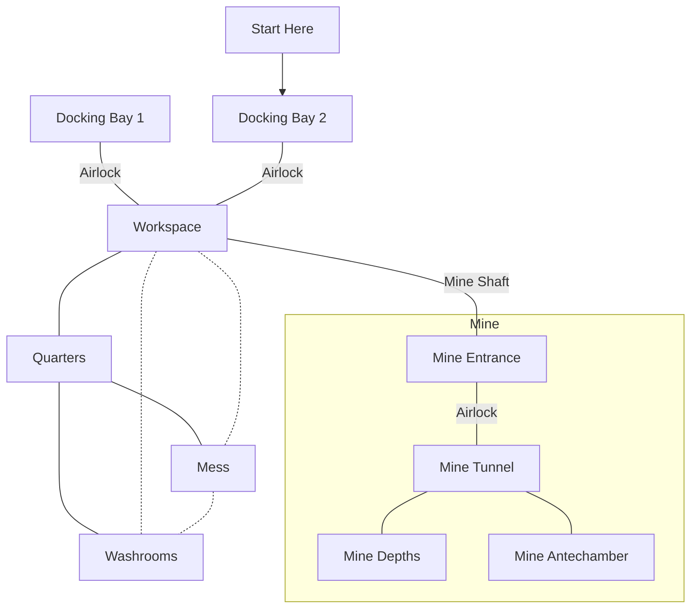

```statblock
layout: Basic Pathfinder 2e Layout
name: Test
level: 20
alignment: Chaotic Evil
size: Medium
perception:
  - name: "Perception"
    desc: "Perception +40; __darkvision__"
languages: All
ac: 42
```
